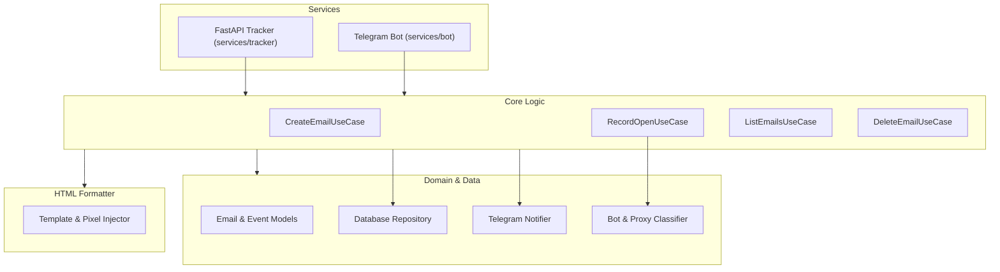

<p align="center">
  
</p>

<h1 align="center">MailBlinker</h1>

<p align="center">
  <em>An unbranded, self-hosted email tracker and Mailtrack alternative. Features real-time Telegram open alerts, anti-cache defense, heuristic bot filtering, and rich telemetry (IP location, device breakdown, and forwarding detection).</em>
</p>

---

## What It Does

When sending important emails (like project proposals, outreach, or applications), it is helpful to know if the message arrived and was read. This project provides:

1. **Invisible Pixel Tracking**: Inserts a 1x1 transparent image in your email to detect when it gets opened.
2. **Bot and Proxy Detection**: Uses `crawlerdetect` and `user-agents` to help tell apart automated security crawlers (like Mimecast or Proofpoint), privacy proxies (like Gmail or Apple Mail), and real human opens.
3. **Telegram Notifications**: Sends a message to your Telegram chat as soon as an open event is detected.
4. **Interactive Bot & REST API**: Create tracked emails either using a Telegram bot wizard (`/format` or `/new`) or directly through HTTP endpoints.
5. **Structured Logs**: Simple JSON logging with file rotation to help monitor your server.

---

## How It Works



---

## Quick Start

### 1. Requirements
* Python >= 3.11
* `uv` (recommended) or standard `pip`

### 2. Setup Environment
Copy `.env.example` to `.env`:
```bash
cp .env.example .env
```

Configure your `.env` variables:
```ini
BASE_URL=http://localhost:8000
DATABASE_URL=sqlite+aiosqlite:///tracker.db
TELEGRAM_BOT_TOKEN=your_token_from_botfather
TELEGRAM_CHAT_ID=your_chat_id_from_userinfobot
API_KEY=your_optional_secret_key
RATE_LIMIT_ENABLED=true
LOG_FILE=logs/app.log
PORT=8000
HOST=0.0.0.0
```

### 3. Install Dependencies
```bash
uv sync --all-packages
```

### 4. Setup Database
```bash
uv run alembic upgrade head
```

### 5. Run the Project
```bash
uv run python run.py
```

This starts both the FastAPI server on port 8000 and the Telegram bot polling process.

### 6. Run with Docker (Alternative)
```bash
docker compose up -d --build
```
This builds and runs MailBlinker in the background with persistent SQLite storage in `./data/`.


---

## Telegram Bot Usage

* `/start` - Displays available commands.
* `/new <Title> | <RecipientEmail>` - Quickly creates a tracked email link (e.g. `/new Proposal | client@example.com`).
* `/format` - Interactive 5-step wizard to compose a formatted email with links.
* `/stats` - Lists recent emails and their open count.
* `/help` - Helpful tips on pasting formatted HTML into Gmail.

### Sending Your Email
1. Run `/new` or `/format` in Telegram to generate your tracked email.
2. Open the generated `.html` attachment in a browser.
3. Select All (`Ctrl+A` / `Cmd+A`), Copy (`Ctrl+C` / `Cmd+C`), and Paste (`Ctrl+V` / `Cmd+V`) into your Gmail compose box.
4. Send your email. When opened, the bot will notify you with the timestamp and detected device.

---

## API Endpoints

### 1. Tracking Pixel
`GET /track/{token}.gif`
* Returns the 1x1 transparent image and records the open event.

### 2. Create Email
`POST /api/emails`
```json
{
  "title": "Project Proposal",
  "recipient_email": "client@example.com",
  "recipient_name": "Sarah",
  "body_text": "Here is the proposal we discussed.",
  "links": [
    { "text": "View Document", "url": "https://example.com/doc.pdf" }
  ]
}
```

### 3. List Emails
`GET /api/emails`
* Returns tracked emails and their recorded open events.

### 4. Delete Email
`DELETE /api/emails/{id}`
* Deletes an email and its history.

### 5. Health Check
`GET /`
* Checks if the server is running.

---

## Database Migrations

This project uses Alembic to manage database changes:

* **Create migration:**
```bash
uv run alembic revision --autogenerate -m "message"
```

* **Apply migrations:**
```bash
uv run alembic upgrade head
```

* **Rollback one migration:**
```bash
uv run alembic downgrade -1
```

---

## Code Quality & Testing

* **Lint with Ruff:**
```bash
uv run --with ruff ruff check .
```

* **Format code with Ruff:**
```bash
uv run --with ruff ruff format .
```

* **Type check with Pyright:**
```bash
uv run --with pyright pyright
```

* **Run test suite with Pytest:**
```bash
uv run pytest
```

---

## License

This project is licensed under the **Business Source License 1.1 (BSL 1.1)**.

* **Free for Personal & Self-Hosted Use**: You are free to view, study, modify, and self-host MailBlinker for personal, educational, and internal non-commercial use.
* **Commercial Protection**: Providing MailBlinker as a paid commercial service or SaaS to third parties requires a commercial license from the author.
* **Conversion**: Automatically converts to open-source **GNU AGPLv3** after the change date.

See the [LICENSE](LICENSE) file for complete legal terms.

